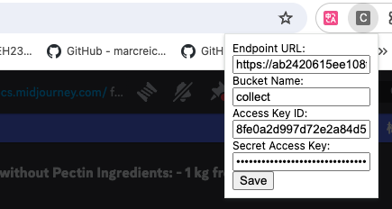
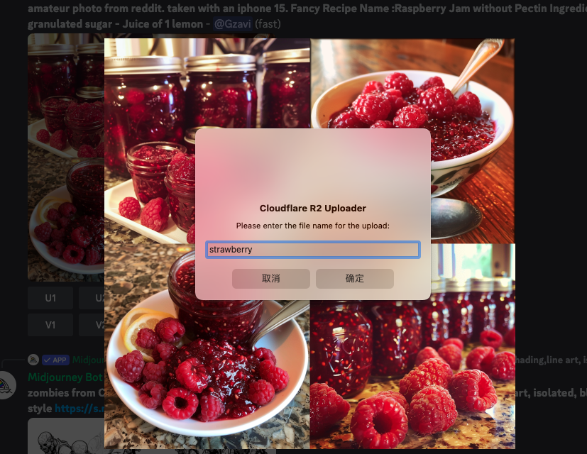
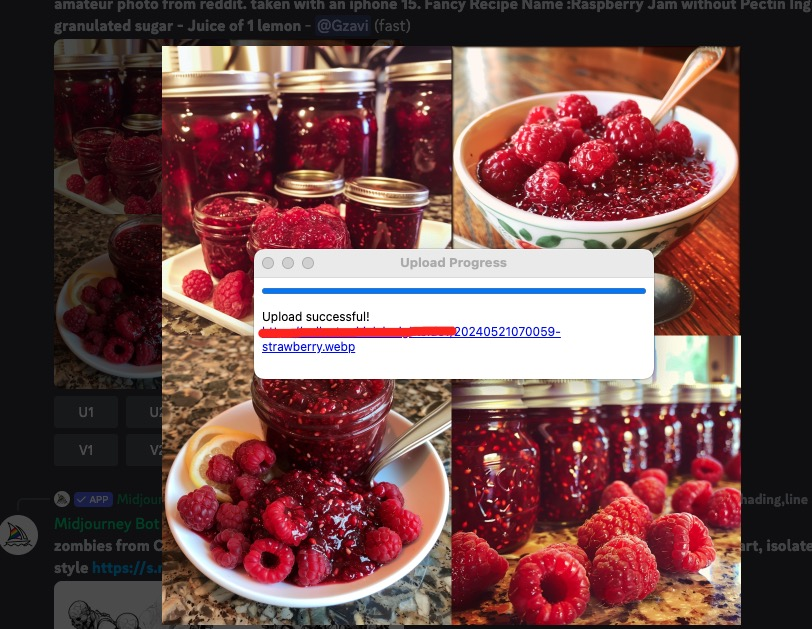

# Image Uploader Chrome Extension for Cloudflare R2

This Chrome extension allows users to upload images directly to a Cloudflare R2 bucket using the AWS SDK for JavaScript. While designed for Cloudflare R2, it might be compatible with AWS S3 with minor modifications.

## Features

- Upload images to a Cloudflare R2 bucket directly from the browser.
- Automatically calculates file extension based on MIME type.
- Customizable file naming convention with timestamp.
- Displays upload progress in a popup window.

## Installation

To install the extension, follow these steps:

1. Clone this repository to your local machine.
2. Open the Chrome browser and go to `chrome://extensions`.
3. Enable Developer mode.
4. Click on "Load unpacked" and select the cloned repository folder.

## Usage

1. Right-click on an image in your browser.
2. Select "Upload Image to CloudFlare R2" from the context menu.
3. Enter the desired filename when prompted.
4. Monitor the upload progress in the popup window.

## Configuration

Before using the extension, you need to configure the following parameters in the extension popup:

- **Endpoint URL**: The URL of your Cloudflare R2 endpoint.
  - For AWS S3, use the appropriate regional endpoint (if trying with AWS S3).
- **Access Key ID**: Your Cloudflare R2 access key ID.
- **Secret Access Key**: Your Cloudflare R2 secret access key.
- **Bucket Name**: The name of the R2 bucket where you want to upload images.

## Compatibility with AWS S3

While this extension is designed for Cloudflare R2, it might work with AWS S3 with the following considerations:
- Ensure the endpoint URL is correctly set to an AWS S3 endpoint.
- Make sure the access keys are for AWS IAM.
- You might need to explicitly specify the region for AWS S3 in the script.

## Contributing

If you'd like to contribute to this project, please follow these steps:

1. Fork the repository.
2. Create a new branch (`git checkout -b feature`).
3. Make your changes.
4. Commit your changes (`git commit -am 'Add feature'`).
5. Push to the branch (`git push origin feature`).
6. Create a new Pull Request.

## License

This project is licensed under the [MIT License](LICENSE).

